  <picture>
    <source media="(prefers-color-scheme: dark)"  srcset="tomo/pet.svg">
    <source media="(prefers-color-scheme: light)" srcset="tomo/pet-light.svg">
    
  </picture>

<h1 align="center">Aditya Raj</h1>

  

  
  
  

---

Third-year B.Tech CSE at **IIIT Bhagalpur**.

Co-founder of **Kalaa SkillTech** — vocational training for rural youth, **₹10 lakh seed funding under Startup Bihar**, selected from 10,000+ applicants.

Everything below is deployed and clickable.

## Selected work

| Project | What's interesting | Stack |
| :--- | :--- | :--- |
| **[Rys](https://github.com/me-adityaraj8/career-os)** [live ↗](https://rys-eight.vercel.app) | Job-search workspace. Kanban drag-and-drop that persists atomically, and AI behind a provider-agnostic gateway with a deterministic mock mode. | `React` `Express` `PostgreSQL` `Docker` |
| **[Parley](https://github.com/me-adityaraj8/parley)** [live ↗](https://parley-taupe-phi.vercel.app) | P2P video calling — **media never touches a server**. WebRTC mesh, Perfect Negotiation, Durable Objects signalling. 56 tests. | `Next.js 15` `WebRTC` `Cloudflare` |
| **[Kairo](https://github.com/me-adityaraj8/kairo)** [live ↗](https://kairo-olive-beta.vercel.app) | Gamified task tracker. XP, gold and streaks all computed **server-side**, so the client can't cheat them. | `Next.js 14` `Prisma` `NextAuth` |

## Problem solving

**500+ problems solved** across Codeforces and LeetCode, over **309 active days** with an
**82-day peak streak on Codolio** and **50+ rated contests**. The consistency matters more to me than
any single rating.

## What I build with

<table>
  <tr>
    <td valign="top" width="50%">

**💻 Languages**
 

 

**⚙️ Backend & Data**
 

</td>
<td valign="top" width="50%">

**🎨 Frontend**
 

 

**🔧 Infra & Tools**
 

</td>
  </tr>
</table>

## Currently

Building out **Rys**, writing a native macOS app in Swift, and keeping the Codeforces streak
alive. Open to SDE internships — my inbox is open.

## GitHub

  

   
  
  <picture>
    <source media="(prefers-color-scheme: dark)" srcset="https://streak-stats.demolab.com?user=me-adityaraj8&theme=darcula&hide_border=true&background=00000000">
    
  </picture>

  

## Reach me

[me.adityaraj8@gmail.com](mailto:me.adityaraj8@gmail.com) &nbsp;·&nbsp; [LinkedIn](https://linkedin.com/in/aditya-raj-kumar-dora-44145b322) &nbsp;·&nbsp; [github.com/me-adityaraj8](https://github.com/me-adityaraj8)
